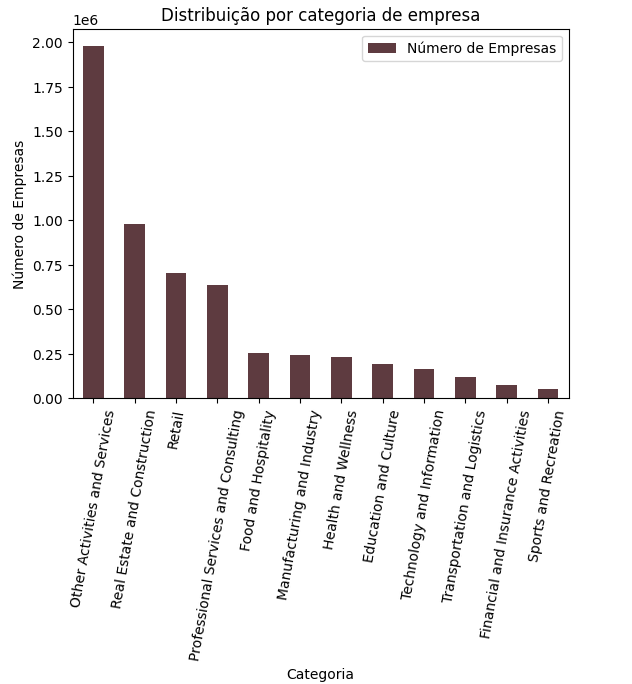
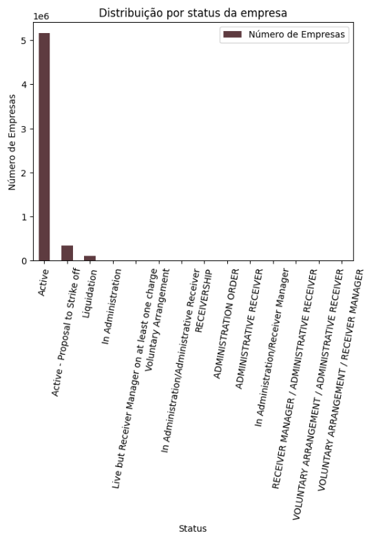
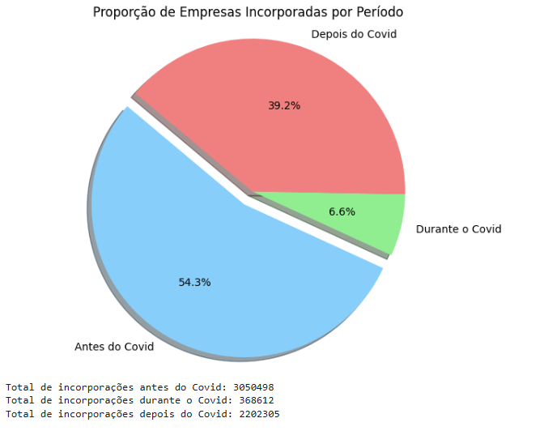
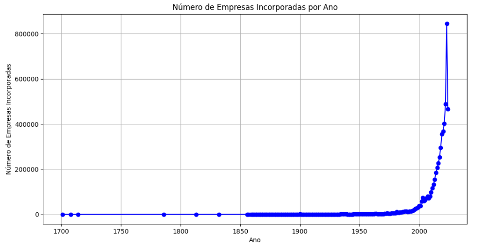

# Case_Meivcore

## Instruções de como utilizar o repositório:

Para rodar o notebok siga os passos abaixo:

1. Faça o download do repositório Github na sua máquina.
2. Certifique-se de ter a versão do Python 3.12 instalada.
3. Todas as bibliotecas necessárias então descritas no arquivo `pyproject.toml`.
4. Lembre-se de fazer o download do arquivo csv [aqui](https://click.api.drift.com/click/e21b0ef0-2218-4578-b02a-6082454a8f2d?u=http%3A%2F%2Fdownload.companieshouse.gov.uk%2Fen_output.html&h=f0fb4708ebae07eacd660f229c0d02f5) e salvá-lo dentro da pasta `data` deste repositório. 
5. IMPORTANTE: No notebook `analysis_Meivcore.ipynb` certifique-se de atualizar o caminho do arquivo csv e do nome do arquivo na primeira linha de comando. 

## Contexto do Projeto

O projeto em questão visa entender o contexto a criação de empresas no Reino Unido (UK). O dataset é de acesso público e pode ser encontrado [aqui](https://click.api.drift.com/click/e21b0ef0-2218-4578-b02a-6082454a8f2d?u=http%3A%2F%2Fdownload.companieshouse.gov.uk%2Fen_output.html&h=f0fb4708ebae07eacd660f229c0d02f5) e foi disponibilizado pela empresa em questão para aferição de habilidade técnicas.

Para a análise foi realizado um processo de ETL que consistiu nas seguintes etapas, seguidas das respectivas conclusões:

### ETL:
- **Identificação do tamanho do dataset:**

    5621440 linhas e 55 colunas dos quais só foram importados 500 mil linhas, por motivo de performance.

- **Identificação de nulos:** 

    Foram identificadas colunas com mais de 50% de dados nulos, por opção, estas colunas foram removidas pois não fornecia informação suficiente para as análises.

- **Tratamento do nome das colunas:**

    Foram retirados espaços em branco antes do nome das colunas e os prefixos foram retirados para facilitar o entendimento e manipulação dos dados.

- **Dados duplicados:**

    Apesar de não haver registros duplicados no dataset, identificou-se algumas empresas com mesmo nome e número de registros diferentes. Estas empresas foram consideradas diferentes por apresentarem números de registros diferentes. Uma possível justificativa é devido a diferentes entidades legais ou filiais em diversas jurisdições, alterações estruturais como fusões e aquisições, nomes comerciais variados para diferentes linhas de negócios, além da existência de empresas distintas com o mesmo nome em diferentes setores ou localidades.

- **Criação de categorias**

    Criou-se categorias para separar as empresas em diferentes setores.

 ### PRINCIPAIS CONCLUSÕES:

#### Visão Geral

- **Distribuição Geográfica**: Mais de 95% das empresas na base de dados estão registradas no Reino Unido, indicando foco principal para análises específicas.

- **Setores Chave na Economia**:
  - "Real Estate and Construction" e "Retail" são setores dominantes, refletindo grande impacto no emprego e no PIB.
  - "Health and Wellness" mostra crescimento significativo, sugerindo um nicho promissor.

  

- **Status das Empresas**:
  - Predominância de empresas ativas, indicando estabilidade.
  - Notável número de empresas em liquidação e administração, sinalizando desafios financeiros.

  

#### Análise de Risco

- **Empresas em Dificuldades**:
  - Aquelas em liquidação e administração representam risco elevado para credores e investidores.
  - Empresas com status "Active - Proposal to Strike off" podem enfrentar incertezas operacionais.

#### Tendências Temporais

- **Impacto da COVID-19**:
  - Redução significativa nas novas incorporações durante a pandemia (368.612), comparado a períodos pré (3.050.498) e pós (2.202.305), refletindo impacto inicial seguido de recuperação.

  

- **Criação de Empresas**:
  - Tendência crescente de novas incorporações após 2016, com picos notáveis em 2024, 2021, 2020 e 2019, possivelmente influenciados por mudanças econômicas e regulatórias.

  

### MACHINE LEARNING MODEL

**Problemas Observados no Modelo**

Durante a avaliação do modelo de classificação, identificamos alguns problemas significativos que afetam sua performance:

- Desbalanceamento de Classes: Algumas classes têm um número muito baixo de exemplos no conjunto de dados. Por exemplo, a classe representada pela linha 0 na matriz de confusão possui apenas 1 amostra na coluna 5. Isso pode resultar em métricas não calculáveis, como Sensibilidade, quando não há verdadeiros positivos ou falsos negativos para uma classe.

- Adoção do F1-Score para Avaliar o Modelo
Para uma avaliação mais equilibrada do desempenho do modelo, utilizamos o F1-Score, que combina precisão e recall (sensibilidade) em uma única métrica. Os resultados obtidos foram os seguintes:

- F1-Score por Classe:

    - Classes 0 e 1: F1-Score de 0, indicando que o modelo não conseguiu prever corretamente essas classes.
    - Classe 2: F1-Score de 0.974, indicando um bom desempenho.
    - Classe 3: F1-Score de 0.569, indicando um desempenho moderado.
    - Classes 4 a 7: F1-Score de 0, indicando falhas na previsão dessas classes.

- F1-Score Médio Ponderado: 0.9399785556040684

Média ponderada dos F1-Scores de cada classe, levando em consideração o desbalanceamento das classes.

- F1-Score Médio Macro: 0.25539847298193885

Média aritmética dos F1-Scores de todas as classes, sem considerar o desbalanceamento.

- F1-Score Médio Micro: 0.94275

F1-Score global considerando todas as predições e classes.

**Interpretação**

Alguns F1-Scores são 0, indicando dificuldades significativas do modelo em prever corretamente essas classes específicas. Isso pode ser atribuído ao desbalanceamento de dados ou à falta de representação adequada das classes no conjunto de treinamento.

Próximos Passos Sugeridos
Considerando os desafios identificados, os próximos passos sugeridos para melhorar o modelo incluem:

Amostragem Adequada: Reavaliar a amostragem de dados para garantir uma representação mais equilibrada de todas as classes, utilizando o conjunto completo de dados disponíveis no CSV.

Avaliação de Outros Modelos: Explorar a eficácia de diferentes modelos de classificação e técnicas de balanceamento de classes para melhorar o desempenho geral do modelo.

---
**DASHBOARD**
Foi elaborado um dashboard com algumas métricas selecionadas para entender o perfil das empresas ao longo dos anos.

O documento não foi disponibilizado no repositório devido exeder o limite de tamanho para upload de arquivo. Entretanto abaixo segue o vídeo onde podem visualiza-lo.

## Vídeo de Demonstração

Assista ao vídeo de demonstração:

<video width="720" height="480" controls>
  <source src="https://github.com/VanGaigher/technical_case/raw/main/dashboard_final.mp4" type="video/mp4">
  Your browser does not support the video tag.
</video>

**Observação**: Para detalhes específicos e gráficos, consulte o documento completo ou os anexos fornecidos com este README.

